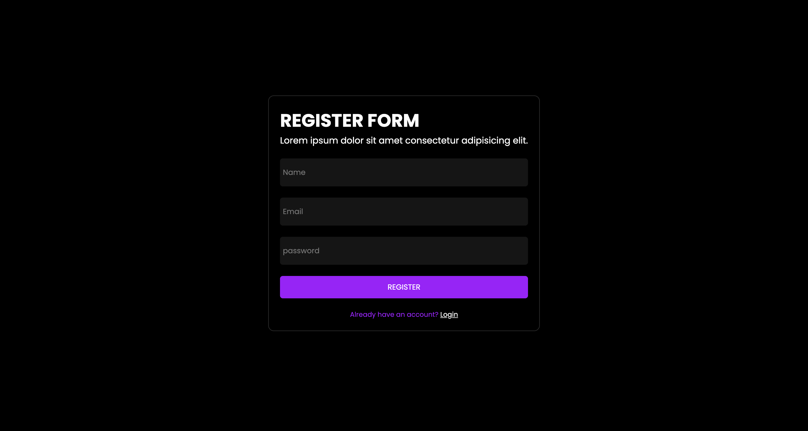

# SIMPLE-AUTH

A simple authentication system built with HTML, CSS, and JavaScript that allows users to **register** and **log in**. User credentials are stored securely in **LocalStorage** for demonstration purposes.

## 🚀 Features

- User registration form
- User login form
- LocalStorage-based credential storage
- Basic form validation
- Responsive UI using CSS

## 🛠️ Built With

- HTML
- CSS
- JavaScript (Vanilla)
- LocalStorage (Browser API)

## 🧪 How It Works

1. **Register**:

   - User inputs username and password.
   - Credentials are saved in LocalStorage as a key-value pair.

2. **Login**:
   - User enters the same username and password.
   - The input is validated against the LocalStorage data.
   - If matched, login is successful; else, an error is shown.

## ⚠️ Disclaimer

This project is intended for **learning/demo purposes only**. Do not use LocalStorage to store sensitive user data (like passwords) in real-world applications. Use proper back-end authentication with encryption in production.

## 📸 Preview

 <!-- Optional: Add a screenshot if you have one -->

## 📄 License

This project is open source and available under the [MIT License](LICENSE).
